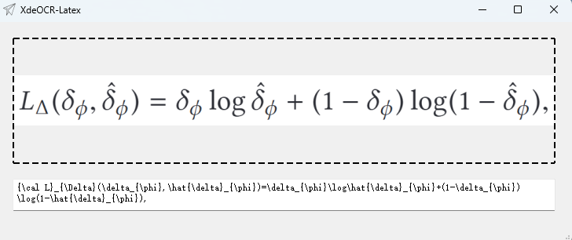

## How to use
First of all, you need to install the following packages:
```
rapid_latex_ocr
PyQt5
pyqt5-tools
```
And then, you only run:
```
python XdeOCR.py
```

## How to generate exe
We use pyinstaller to package the programme. In order to package the model weights and parameter files as well, we need to adjust the .spec file. We have given an example of .spec, please modify it accordingly. The main thing is to change the absolute paths in it to your project absolute paths, i.e. change `F:\XdeOCR` to `yours`.
```
# -*- mode: python ; coding: utf-8 -*-


a = Analysis(
    ['XdeOCR.py',
    'F:\XdeOCR\XdeOCR_window.py'
    ],
    pathex=['F:\XdeOCR'],
    binaries=[],
    datas=[('F:\XdeOCR\models\config.yaml', "models"),
    ('F:\XdeOCR\models\decoder.onnx', "models"),
    ('F:\XdeOCR\models\encoder.onnx', "models"),
    ('F:\XdeOCR\models\image_resizer.onnx', "models"),
    ('F:\XdeOCR\models\tokenizer.json', "models")
    ],
    hiddenimports=[],
    hookspath=[],
    hooksconfig={},
    runtime_hooks=[],
    excludes=[],
    noarchive=False,
    optimize=0,
)
pyz = PYZ(a.pure)

exe = EXE(
    pyz,
    a.scripts,
    [],
    exclude_binaries=True,
    name='XdeOCR',
    debug=False,
    bootloader_ignore_signals=False,
    strip=False,
    upx=True,
    console=True,
    disable_windowed_traceback=False,
    argv_emulation=False,
    target_arch=None,
    codesign_identity=None,
    entitlements_file=None,
)
coll = COLLECT(
    exe,
    a.binaries,
    a.datas,
    strip=False,
    upx=True,
    upx_exclude=[],
    name='XdeOCR',
)
```

## Result
<div align='center'></div>